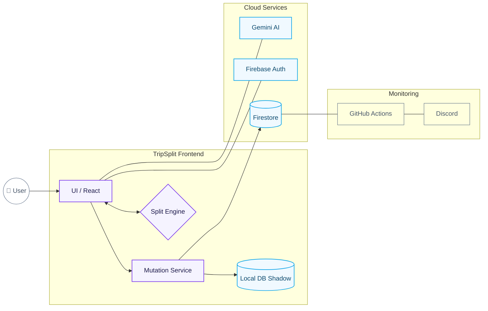

<div align="center">
  
  
  
  
  
</div>

<br />

<div align="center">
  <h1>✈️ TripSplit</h1>
  <p><strong>Collaborative expense tracking for group trips</strong></p>
  <p>Split costs, simplify debts with smart algorithms, and settle up smart.</p>
</div>

---

| Feature | Description |
|---------|-------------|
| 🔄 **Real-time Sync** | Expenses sync instantly across all devices via Firestore |
| 💰 **Smart Settlements** | Min-Cash-Flow algorithm minimizes the number of transactions |
| 🧾 **AI Receipt Scanning** | Powered by Gemini 2.0 Flash for automatic expense entry |
| ⚖️ **Itemized Splitting** | Manually split expenses unequally for granular "micromanagement" |
| 👥 **Ghost Members** | Add people who aren't on the app yet |
| 📱 **Native Mobile Feel** | Bottom-sheet modals, safe-area support, and notch optimization |
| 🏷️ **Segregated Splits** | Filter settlements by Major (flights, hotels) vs Daily (food) |

---

## 🏗️ Technical Architecture



### Data Model

```
/trips/{tripId}
    ├── name, code, currency, created_by, status
    │
    ├── /members/{memberId}
    │       └── display_name, user_id, role (admin/member/ghost)
    │
    └── /expenses/{expenseId}
            ├── description, amount, category, type
            ├── paid_by → references member ID (not user ID)
            ├── split_type (equal/custom)
            │
            └── /splits/{splitId}  (for itemized splits only)
                    └── member_id, amount
```

> **Key Design Decision:** `paid_by` always references `trip_members.id`, never `auth.users.id`. This enables ghost members (people without accounts) to be payers. 
> **Advanced Splitting:** Manual itemized splits allow for unequal distributions (e.g., individual meal prices) within a single expense.

---

## 🧮 Core Algorithm: Min-Cash-Flow

The settlement algorithm minimizes the number of transactions needed to settle all debts.

```
Example: 4 members with balances
┌─────────┬──────────┐
│ Member  │ Balance  │
├─────────┼──────────┤
│ Rahul   │ +₹3000   │  (is owed)
│ Amit    │ +₹1000   │  (is owed)
│ Priya   │ -₹2500   │  (owes)
│ Neha    │ -₹1500   │  (owes)
└─────────┴──────────┘

Naive: Up to 6 transactions (N*(N-1)/2)
Min-Cash-Flow: Only 3 transactions ✓

Result:
  Priya  ──₹2500──▶  Rahul
  Neha   ──₹500───▶  Rahul  
  Neha   ──₹1000──▶  Amit
```

**Algorithm Steps:**
1. Calculate net balance for each member: `(Total Paid) - (Total Share)`
2. Separate into Debtors (negative) and Creditors (positive)
3. Sort both lists by absolute value (descending)
4. Greedily match largest debtor with largest creditor
5. Repeat until all balances are zero

---

## 🛡️ Security Model

### Firebase Security Rules
```javascript
// Users can only access trips they're members of
match /trips/{tripId} {
  allow read: if isTripMember(tripId);
  allow update: if isTripAdmin(tripId);
  
  match /members/{memberId} {
    allow read: if isTripMember(tripId);
    allow write: if isTripAdmin(tripId) || isSelfJoin();
  }
}
```

### Sync & Offline Strategy (Sync-Ready)
- **Local Shadow**: All writes are mirrored to IndexedDB (via Dexie.js) before hitting Firestore.
- **Single Write Path**: All mutations flow through `mutationService.ts` for consistency.
- **Conflict Resolution**: Last-write-wins based on `updated_at` server timestamps.
- **Offline Behavior**: Changes are queued locally and synchronized upon reconnection.
```

### AI Trust Boundary
- All AI-extracted data (from receipts) is treated as **DRAFT ONLY**
- User must explicitly confirm before persisting
- Category mapping has safe fallbacks to 'other'

---

## 🚀 Quick Start

### Prerequisites
- Node.js 18+
- Firebase project with Firestore + Auth enabled

### Installation

```bash
# Clone the repository
git clone https://github.com/Ashborn-047/trip_split.git
cd trip_split

# Install dependencies
npm install

# Set up environment variables
cp .env.example .env
# Edit .env with your Firebase config

# Start development server
npm run dev
```

### Firebase Setup

1. Create a project at [console.firebase.google.com](https://console.firebase.google.com)
2. Enable **Firestore Database** (Start in test mode)
3. Enable **Authentication** → Anonymous sign-in
4. Get your web app config from Project Settings > Your Apps

### Environment Variables

Create a `.env` file with:

```env
VITE_FIREBASE_API_KEY=your-api-key
VITE_FIREBASE_AUTH_DOMAIN=your-project.firebaseapp.com
VITE_FIREBASE_PROJECT_ID=your-project-id
VITE_FIREBASE_STORAGE_BUCKET=your-project.appspot.com
VITE_FIREBASE_MESSAGING_SENDER_ID=your-sender-id
VITE_FIREBASE_APP_ID=your-app-id
VITE_GEMINI_API_KEY=your-gemini-api-key  # Optional, for receipt scanning
```

---

## 📁 Project Structure

```
src/
├── config/
│   └── firebase.ts         # Firebase initialization + offline persistence
│
├── services/
│   ├── authService.ts      # Anonymous + email authentication
│   ├── tripService.ts      # Trip CRUD + real-time subscriptions
│   ├── expenseService.ts   # Expense management + splits
│   └── geminiService.ts    # AI receipt scanning
│
├── utils/
│   ├── settlement.ts       # Min-Cash-Flow algorithm (v1.0)
│   └── balanceCalculator.ts # Per-member balance computation
│
├── components/
│   ├── LoginScreen.tsx     # Create/join trip flow
│   ├── Dashboard.tsx       # Main app with tabs
│   ├── ExpensesTab.tsx     # Expense list + filters
│   ├── MembersTab.tsx      # Member management + balances
│   ├── SettleTab.tsx       # Settlement transactions
│   └── AddExpenseModal.tsx # Add expense with AI scan
│
├── types/
│   └── index.ts            # TypeScript interfaces
│
└── App.tsx                 # Root component with auth state
```

---

## 🔄 CI/CD

### GitHub Actions

| Workflow | Trigger | Purpose |
|----------|---------|---------|
| `deploy.yml` | Push to main | Automated deployment to GitHub Pages via Official Actions |
| `health-check.yml` | Every 12 hours | Proactive Firebase health monitoring with Discord alerts |

### Required Secrets

Add these to your GitHub repository secrets:

- `VITE_FIREBASE_API_KEY`
- `VITE_FIREBASE_AUTH_DOMAIN`
- `VITE_FIREBASE_PROJECT_ID`
- `VITE_FIREBASE_STORAGE_BUCKET`
- `VITE_FIREBASE_MESSAGING_SENDER_ID`
- `VITE_FIREBASE_APP_ID`
- `DISCORD_WEBHOOK_URL` *(optional, for health check alerts)*

---

## 🚢 Deployment

### Vercel (Recommended)

1. Import your GitHub repo in [Vercel](https://vercel.com)
2. Add environment variables in Project Settings
3. Deploy!

[](https://vercel.com/new/clone?repository-url=https://github.com/Ashborn-047/trip_split)

---

## 📝 Future Roadmap

- [ ] Email/password authentication upgrade
- [ ] Export expenses to CSV/PDF
- [ ] Currency conversion for international trips
- [ ] Push notifications for new expenses
- [ ] Native mobile app (React Native)

---

## 🤝 Contributing

Contributions are welcome! Please read our contributing guidelines before submitting a PR.

---

## 📄 License

MIT License - see [LICENSE](LICENSE) for details.

---

<div align="center">
  <p>Built with ❤️ for travelers who hate math</p>
  <p>
    <a href="https://github.com/Ashborn-047/trip_split/issues">Report Bug</a> •
    <a href="https://github.com/Ashborn-047/trip_split/issues">Request Feature</a>
  </p>
</div>
