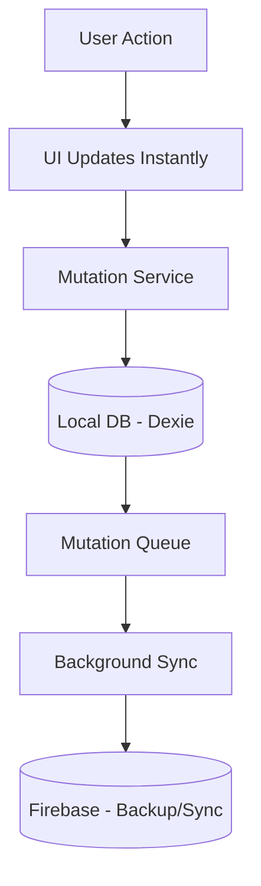

<div align="center">
  
  
  
  
  
</div>

<br />

<div align="center">
  <h1>✈️ TripSplit</h1>
  <p><strong>Collaborative expense tracking for group trips</strong></p>
  <p>Split costs, simplify debts with smart algorithms, and settle up smart.</p>
</div>

---

| Feature | Description |
|---------|-------------|
| 🔄 **Real-time Sync** | Expenses sync instantly across all devices via Firestore |
| 💰 **Smart Settlements** | Min-Cash-Flow algorithm minimizes the number of transactions |
| 🧾 **AI Receipt Scanning** | Powered by Gemini 2.0 Flash for automatic expense entry |
| ⚖️ **Itemized Splitting** | Manually split expenses unequally for granular "micromanagement" |
| 👥 **Ghost Members** | Add people who aren't on the app yet |
| 📱 **Native Mobile Feel** | Bottom-sheet modals, safe-area support, and notch optimization |
| 🏷️ **Segregated Splits** | Filter settlements by Major (flights, hotels) vs Daily (food) |

---

## 🏗️ Technical Architecture

```mermaid
graph LR
    %% Minimalist Styles
    classDef default fill:none,stroke:#64748b,stroke-width:1px,color:#475569;
    classDef primary fill:#f5f3ff,stroke:#7c3aed,stroke-width:1.5px,color:#1e1b4b;
    classDef accent fill:#f0f9ff,stroke:#0ea5e9,stroke-width:1.5px,color:#0c4a6e;
    
    %% Components
    User((👤 User))
    
    subgraph App ["TripSplit Frontend"]
        UI[UI / React]
        Mut[Mutation Service]
        LDB[(Local DB Shadow)]
        Logic{Split Engine}
    end
    
    subgraph Services ["Cloud Services"]
        Auth[Firebase Auth]
        DB[(Firestore)]
        AI[Gemini AI]
    end
    
    subgraph Ops ["Monitoring"]
        CI[GitHub Actions]
        Alerts[Discord]
    end
    
    %% Flow
    User --> UI
    UI --> Mut
    Mut --> LDB
    Mut --> DB
    UI <--> Logic
    UI --- Auth
    UI --- AI
    DB --- CI
    CI --- Alerts
    
    %% Branding
    class UI,Mut,Logic primary;
    class LDB,Auth,DB,AI accent;
```



### Data Model

```
/trips/{tripId}
    ├── name, code, currency, created_by, status
    │
    ├── /members/{memberId}
    │       └── display_name, user_id, role (admin/member/ghost)
    │
    └── /expenses/{expenseId}
            ├── description, amount, category, type
            ├── paid_by → references member ID (not user ID)
            ├── split_type (equal/custom)
            │
            └── /splits/{splitId}  (for itemized splits only)
                    └── member_id, amount
```

> **Key Design Decision:** `paid_by` always references `trip_members.id`, never `auth.users.id`. This enables ghost members (people without accounts) to be payers. 
> **Advanced Splitting:** Manual itemized splits allow for unequal distributions (e.g., individual meal prices) within a single expense.

---

## 🧮 Core Algorithm: Min-Cash-Flow

The settlement algorithm minimizes the number of transactions needed to settle all debts.

```
Example: 4 members with balances
┌─────────┬──────────┐
│ Member  │ Balance  │
├─────────┼──────────┤
│ Rahul   │ +₹3000   │  (is owed)
│ Amit    │ +₹1000   │  (is owed)
│ Priya   │ -₹2500   │  (owes)
│ Neha    │ -₹1500   │  (owes)
└─────────┴──────────┘

Naive: Up to 6 transactions (N*(N-1)/2)
Min-Cash-Flow: Only 3 transactions ✓

Result:
  Priya  ──₹2500──▶  Rahul
  Neha   ──₹500───▶  Rahul  
  Neha   ──₹1000──▶  Amit
```

**Algorithm Steps:**
1. Calculate net balance for each member: `(Total Paid) - (Total Share)`
2. Separate into Debtors (negative) and Creditors (positive)
3. Sort both lists by absolute value (descending)
4. Greedily match largest debtor with largest creditor
5. Repeat until all balances are zero

---

## 🛡️ Security Model

### Firebase Security Rules
```javascript
// Users can only access trips they're members of
match /trips/{tripId} {
  allow read: if isTripMember(tripId);
  allow update: if isTripAdmin(tripId);
  
  match /members/{memberId} {
    allow read: if isTripMember(tripId);
    allow write: if isTripAdmin(tripId) || isSelfJoin();
  }
}
```

---

## 🧠 TripSplit Architecture & Offline-First Design

TripSplit is built as a **local-first, offline-first web application**.

Unlike traditional apps that depend on the network to function, TripSplit is designed to **work entirely on your device**, and uses the internet only when it’s actually needed.

This is a deliberate architectural choice.

### 🚀 High-Level Philosophy

**TripSplit works offline by default.  
The internet is used only for syncing, sharing, and backup.**

This means:
- You don’t wait for servers to respond
- Poor connectivity doesn’t break the app
- Travel scenarios work naturally
- Sync happens quietly in the background

### 🧱 System Architecture (Simplified)



### Key Idea
- **Local Database is the primary source of truth**
- **Firebase is not required for basic usage**
- **Sync happens automatically when online**

### 📴 Offline-First Behavior

Once the app has been opened at least once:

#### ✅ What works fully offline
- Create trips
- Add members (including offline / ghost members)
- Add expenses
- Split expenses
- View balances
- Settle amounts logically
- Close and reopen the app

All actions are saved **locally and immediately**.

No loading screens. No “retry later” errors.

### 🔁 Automatic Sync (No User Action Required)

When your device reconnects to the internet:
- Sync starts **automatically**
- All offline changes are sent to Firebase in batches
- Data is backed up securely
- Other participants receive updates
- Conflicts (if any) are detected safely

There is **no “Sync” button** and nothing for the user to manage.

### 💾 Local Data Storage (How Your Data Is Saved)

TripSplit uses **IndexedDB** (via Dexie.js) on your device.
Data survives page reloads, browser restarts, and device restarts. Much safer than `localStorage` or in-memory state.

### ☁️ Why Firebase Still Exists

Firebase is used for syncing data between users, backing up local data, and recovering data on new devices. Think of it as **long-term memory and coordination**, not control.

### ⚠️ Honest Limitations (Important)

- **Clearing App / Browser Data**: If you manually clear site data or browser storage before syncing, local data will be lost.
- **Unsynced Changes**: If you never reconnect to the internet, changes exist only on your device and cannot be backed up.

### 🧠 Conflict Handling

If two people change the same thing while offline, both changes are preserved locally and the system detects the conflict during sync. Conflicts are handled explicitly to prevent hidden data loss.

---

### AI Trust Boundary
- All AI-extracted data (from receipts) is treated as **DRAFT ONLY**
- User must explicitly confirm before persisting
- Category mapping has safe fallbacks to 'other'

---

## 🚀 Quick Start

### Prerequisites
- Node.js 18+
- Firebase project with Firestore + Auth enabled

### Installation

```bash
# Clone the repository
git clone https://github.com/Ashborn-047/trip_split.git
cd trip_split

# Install dependencies
npm install

# Set up environment variables
cp .env.example .env
# Edit .env with your Firebase config

# Start development server
npm run dev
```

### Firebase Setup

1. Create a project at [console.firebase.google.com](https://console.firebase.google.com)
2. Enable **Firestore Database** (Start in test mode)
3. Enable **Authentication** → Anonymous sign-in
4. Get your web app config from Project Settings > Your Apps

### Environment Variables

Create a `.env` file with:

```env
VITE_FIREBASE_API_KEY=your-api-key
VITE_FIREBASE_AUTH_DOMAIN=your-project.firebaseapp.com
VITE_FIREBASE_PROJECT_ID=your-project-id
VITE_FIREBASE_STORAGE_BUCKET=your-project.appspot.com
VITE_FIREBASE_MESSAGING_SENDER_ID=your-sender-id
VITE_FIREBASE_APP_ID=your-app-id
VITE_GEMINI_API_KEY=your-gemini-api-key  # Optional, for receipt scanning
```

---

## 📁 Project Structure

```
src/
├── config/
│   └── firebase.ts         # Firebase initialization + offline persistence
│
├── services/
│   ├── authService.ts      # Anonymous + email authentication
│   ├── tripService.ts      # Trip CRUD + real-time subscriptions
│   ├── expenseService.ts   # Expense management + splits
│   └── geminiService.ts    # AI receipt scanning
│
├── utils/
│   ├── settlement.ts       # Min-Cash-Flow algorithm (v1.0)
│   └── balanceCalculator.ts # Per-member balance computation
│
├── components/
│   ├── LoginScreen.tsx     # Create/join trip flow
│   ├── Dashboard.tsx       # Main app with tabs
│   ├── ExpensesTab.tsx     # Expense list + filters
│   ├── MembersTab.tsx      # Member management + balances
│   ├── SettleTab.tsx       # Settlement transactions
│   └── AddExpenseModal.tsx # Add expense with AI scan
│
├── types/
│   └── index.ts            # TypeScript interfaces
│
└── App.tsx                 # Root component with auth state
```

---

## 🔄 CI/CD

### GitHub Actions

| Workflow | Trigger | Purpose |
|----------|---------|---------|
| `deploy.yml` | Push to main | Automated deployment to GitHub Pages via Official Actions |
| `health-check.yml` | Every 12 hours | Proactive Firebase health monitoring with Discord alerts |

### Required Secrets

Add these to your GitHub repository secrets:

- `VITE_FIREBASE_API_KEY`
- `VITE_FIREBASE_AUTH_DOMAIN`
- `VITE_FIREBASE_PROJECT_ID`
- `VITE_FIREBASE_STORAGE_BUCKET`
- `VITE_FIREBASE_MESSAGING_SENDER_ID`
- `VITE_FIREBASE_APP_ID`
- `DISCORD_WEBHOOK_URL` *(optional, for health check alerts)*

---

## 🚢 Deployment

### Vercel (Recommended)

1. Import your GitHub repo in [Vercel](https://vercel.com)
2. Add environment variables in Project Settings
3. Deploy!

[](https://vercel.com/new/clone?repository-url=https://github.com/Ashborn-047/trip_split)

---

## 📝 Future Roadmap

- [ ] Email/password authentication upgrade
- [ ] Export expenses to CSV/PDF
- [ ] Currency conversion for international trips
- [ ] Push notifications for new expenses
- [ ] Native mobile app (React Native)

---

## 🤝 Contributing

Contributions are welcome! Please read our contributing guidelines before submitting a PR.

---

## 📄 License

MIT License - see [LICENSE](LICENSE) for details.

---

<div align="center">
  <p>Built with ❤️ for travelers who hate math</p>
  <p>
    <a href="https://github.com/Ashborn-047/trip_split/issues">Report Bug</a> •
    <a href="https://github.com/Ashborn-047/trip_split/issues">Request Feature</a>
  </p>
</div>
